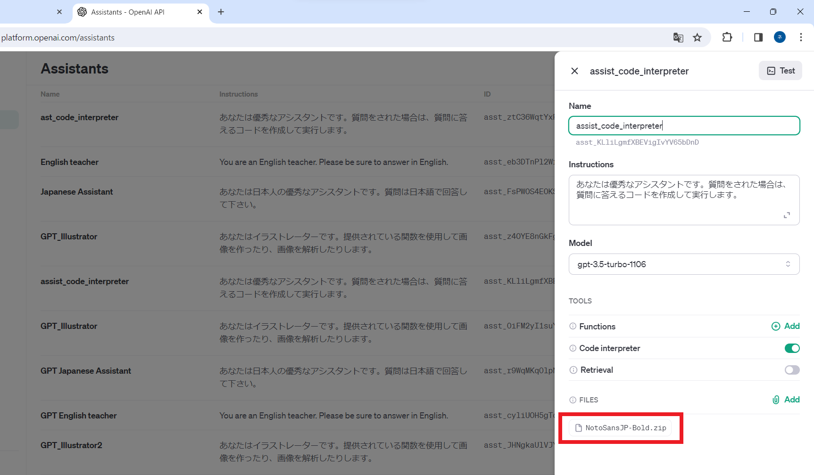

# Code Interpreter対応Chatアプリ

## 説明
GPT Assitants APIのCode Interpreter機能が利用できるChatアプリです。 
データの分析、グラフの作成などが簡単にできます。

 

**デモはこちら**  
https://huggingface.co/spaces/nekoniii3/GPT_Chat_Code_Interpreter

 

## 利用方法

アシスタント作成が必要となります。 
create_assistant.pyを実行しコードインタープリターが利用できるアシスタントの作成を行ってください。
 

また以下の環境変数の設定が必要となります。    

| 変数名 | 役割 | 推奨値 |
| :---:  | :---:  | :---:  |
| OPENAI_API_KEY | OpenAIのAPIキー | --- |
| ASSIST_ID | 作成したアシスタントID | --- |
| MAX_TRIAL | アシスタントへの最大問い合わせ回数 | 50 |
| INTER_SEC | アシスタントへの問い合わせ間隔(秒) | 3 |

 

## 日本語フォントの利用方法（グラフの文字化け対応）
<!-- [日本語フォントの利用ほう](docs\日本語フォント利用)-->
グラフのタイトル・軸名が文字化けする場合があります。 
アシスタントに日本語フォントをZIPで渡し、利用してもらうことで解消されます。

・推奨フォント Noto Sans JP 
https://fonts.google.com/noto/specimen/Noto+Sans+JP

管理画面からアシスタントに渡しておくと便利です。 
https://platform.openai.com/assistants

 

### 参考
[デモ向け日本語フォント利用方法](docs\日本語フォント利用) 
https://qiita.com/nekoniii3/items/1abf7bdcca3dbe3f11ac