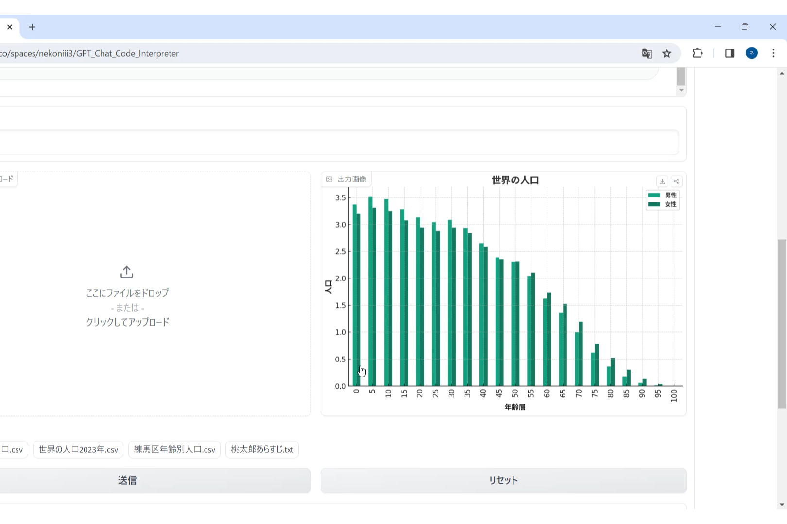

# 日本語フォントの利用方法

GPT_Chat_Code_Interpreterでの日本語フォント利用方法を説明します。 
グラフを描いてもらった際にタイトルや縦・横軸の名称が文字化けすることがあるかと思いますが、こちらを行って頂くとそれが解消されるはずです。
  

## ①GPTに日本語フォントを解凍してもらう

既にGPTのアシスタントにNotoSansJP-Bold.zipというフォントファイル"NotoSansJP-Bold.ttf"をZIPにしたものを渡しています。 
（現在の仕様で.ttfが渡せないため.zipにしています。）
  
まずそれを解凍して手元に置くことをお願いして下さい。

**指示例 「まずNotoSansJP-Bold.zipを解凍してNotoSansJP-Bold.ttfを取得して下さい。」**

 

アシスタントが正常に読み込めたことを確認。

 

## ②GPTに日本語フォントを利用してもらう
あとはこのNotoSansJP-Bold.ttfをアシスタントに使ってもらうだけです。 
グラフなどを描いてもらう際はこのフォントファイルを使用することを指示に追加してください。

**指示例 「次のファイルは○○のデータです。こちらを××グラフにして下さい。タイトル・各軸名はNotoSansJP-Bold.ttfを使って日本語にして下さい。」**

 

※①と一気に指示すればいいと思うかもしれないですが、失敗する可能性が高いので1つずつお願いをすることを推奨します。
 

成功すると日本語のタイトル・軸名で表示してくれます。

フォントファイルの指示が無視されることもあるので、その場合は「NotoSansJP-Bold.ttfを使って、このグラフの各項目名を日本語にして下さい。」と再度お願いして下さい。

※NotoSansJP-Bold.ttf以外のフォントも利用できます。ZIPにして渡して、同様のお願いをして下さい。